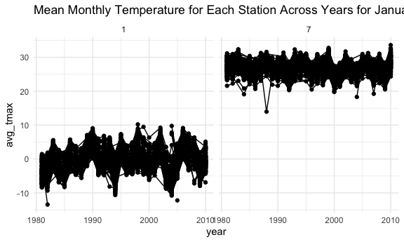
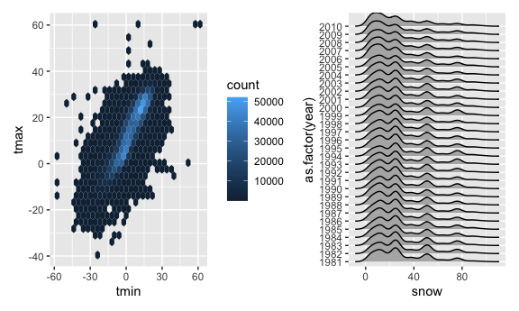
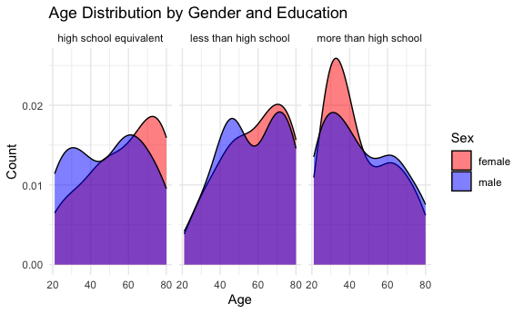
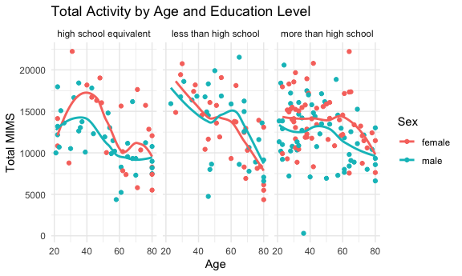
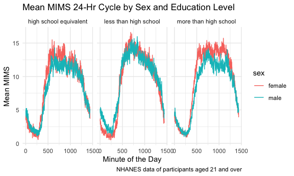
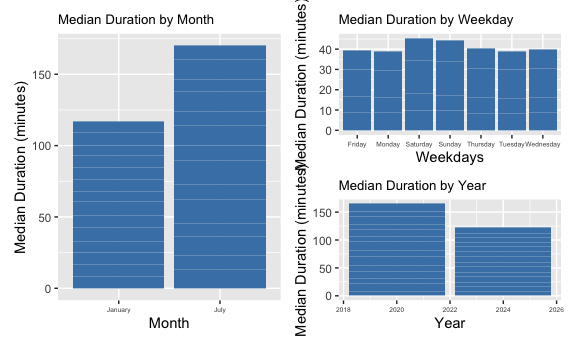
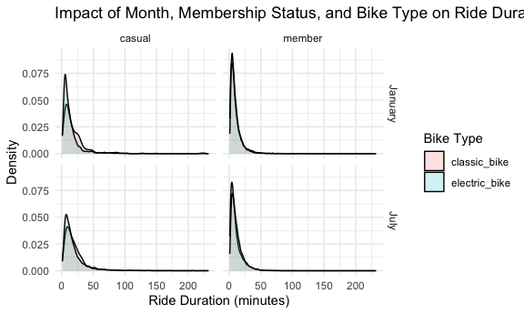

HW3_Markdown
================
Samiha Reza
2024-10-14

## Problem 1

### Data Summary and Data Manipulation

Below is the data summary for the ny_noaa dataset:

    ##       id                 date                 prcp               snow       
    ##  Length:2595176     Min.   :1981-01-01   Min.   :    0.00   Min.   :  -13   
    ##  Class :character   1st Qu.:1988-11-29   1st Qu.:    0.00   1st Qu.:    0   
    ##  Mode  :character   Median :1997-01-21   Median :    0.00   Median :    0   
    ##                     Mean   :1997-01-01   Mean   :   29.82   Mean   :    5   
    ##                     3rd Qu.:2005-09-01   3rd Qu.:   23.00   3rd Qu.:    0   
    ##                     Max.   :2010-12-31   Max.   :22860.00   Max.   :10160   
    ##                                          NA's   :145838     NA's   :381221  
    ##       snwd            tmax               tmin          
    ##  Min.   :   0.0   Length:2595176     Length:2595176    
    ##  1st Qu.:   0.0   Class :character   Class :character  
    ##  Median :   0.0   Mode  :character   Mode  :character  
    ##  Mean   :  37.3                                        
    ##  3rd Qu.:   0.0                                        
    ##  Max.   :9195.0                                        
    ##  NA's   :591786

    ## tibble [2,595,176 × 7] (S3: tbl_df/tbl/data.frame)
    ##  $ id  : chr [1:2595176] "US1NYAB0001" "US1NYAB0001" "US1NYAB0001" "US1NYAB0001" ...
    ##  $ date: Date[1:2595176], format: "2007-11-01" "2007-11-02" ...
    ##  $ prcp: int [1:2595176] NA NA NA NA NA NA NA NA NA NA ...
    ##  $ snow: int [1:2595176] NA NA NA NA NA NA NA NA NA NA ...
    ##  $ snwd: int [1:2595176] NA NA NA NA NA NA NA NA NA NA ...
    ##  $ tmax: chr [1:2595176] NA NA NA NA ...
    ##  $ tmin: chr [1:2595176] NA NA NA NA ...
    ##  - attr(*, "spec")=
    ##   .. cols(
    ##   ..   id = col_character(),
    ##   ..   date = col_date(format = ""),
    ##   ..   prcp = col_integer(),
    ##   ..   snow = col_integer(),
    ##   ..   snwd = col_integer(),
    ##   ..   tmax = col_character(),
    ##   ..   tmin = col_character()
    ##   .. )

The dataset consists of 2.595175^{6} observations and 7 variables. Key
variables include id, date, prcp, snow, snwd, tmax, tmin of which 3 are
numeric, 3 are character. There is one date variable.

The units for the listed variables are: `id`: Weather station ID `date`:
Date of observation `prcp`: Precipitation (tenths of mm) `snow`:
Snowfall (mm) `snwd`: Snow depth (mm) `tmax`: Maximum temperature
(tenths of degrees C) `tmin`: Minimum temperature (tenths of degrees C)

There are 3387623 missing values.

Below is a table of the number of missing values for each variable, and
the proportion of each variable that is missing data. 43.7% of the tmax
and tmin data is missing.

    ##      id    date    prcp    snow    snwd    tmax    tmin 
    ##       0       0  145838  381221  591786 1134358 1134420

    ##        id      date      prcp      snow      snwd      tmax      tmin 
    ## 0.0000000 0.0000000 0.0561958 0.1468960 0.2280331 0.4371025 0.4371264

``` r
ny_noaa$date <- as.Date(ny_noaa$date) 

ny_noaa <- ny_noaa %>% #seperate date into different variables
  mutate(year = year(date),
         month = month(date),
         day = day(date)) %>%
    

  mutate(prcp = as.numeric(prcp) / 10, #mutate variables to be more managemable units
    tmax = as.numeric(tmax) / 10, 
    tmin = as.numeric(tmin) / 10,
    snwd = as.numeric(snwd) / 10)
```

### Snowfall observations

Below is the code chunk and table to determine the most commonly
observed values of snowfall. The most common snowfall value is 0 mm
because most days of the year don’t have snow. The second most comman
finding is NA, because of the high proprotion of missing data.

``` r
ny_noaa %>%
  count(snow) %>%
  arrange(desc(n)) %>%
  head(5)
```

    ## # A tibble: 5 × 2
    ##    snow       n
    ##   <int>   <int>
    ## 1     0 2008508
    ## 2    NA  381221
    ## 3    25   31022
    ## 4    13   23095
    ## 5    51   18274

### Plots

``` r
jan_jul_subset <- ny_noaa %>%
  filter(month %in% c(1, 7)) %>%  # Filter for January (1) and July (7)
  group_by(id, year, month) %>%   # Group by id, year, and month
  summarize(avg_tmax = mean(tmax, na.rm = TRUE), .groups = 'drop') # Calculate average temperature

# Create the ggplot
ggplot(data = jan_jul_subset, aes(x = year, y = avg_tmax, group = id)) + 
  geom_point() + 
  geom_path() +
  facet_grid(~month) +  # Separate panels for each month
  labs(title = "Mean Monthly Temperature for Each Station Across Years for January and July") +
  theme_minimal()
```

    ## Warning: Removed 5970 rows containing missing values or values outside the scale range
    ## (`geom_point()`).

    ## Warning: Removed 5931 rows containing missing values or values outside the scale range
    ## (`geom_path()`).



``` r
hex = 
  ny_noaa %>% 
  ggplot(aes(x = tmin, y = tmax)) + 
  geom_hex()

ridge = 
  ny_noaa %>% 
  filter(snow < 100, snow > 0) %>%
  ggplot(aes(x = snow, y = as.factor(year))) + 
  geom_density_ridges()

hex + ridge
```

    ## Warning: Removed 1136276 rows containing non-finite outside the scale range
    ## (`stat_binhex()`).

    ## Picking joint bandwidth of 3.76



## Problem 2

### Problem 2 Data

``` r
library(readr)
nhanes_accel = 
  read_csv("./nhanes_accel.csv",
  na = c("NA", ",", "")) %>%
  janitor::clean_names()

nhanes_covar = 
  read_csv("./nhanes_covar.csv", 
           na = c("NA", ",", ""),
           skip = 4) %>%
  janitor::clean_names()%>%
  
  mutate(
    sex = factor(sex),
    education = factor(education),
    sex = case_when(
      sex == 1 ~ "male", 
      sex == 2 ~ "female"
    ),

    education = case_when(
      education == 1 ~ "less than high school", 
      education == 2 ~ "high school equivalent", 
      education == 3 ~ "more than high school"
    )
)

#Exclude participants less than 21 years of age, and those with missing demographic data
nhanes_mims = 
  full_join(nhanes_covar, nhanes_accel)%>%
  filter(!is.na(education) & age >= 21) 
```

Here we cleaned, tidied, and joined the data sets while mutating sex and
education into factor variables. The dataset consists of 230
observations and 1445 variables.

### Sex and Education Table

Here we have table of number of female and male particpants in each of
the education categories: high school, less than high school and more
then high school. There are more female and male participants that have
had more than high school. Less than high school is also comparable
between the two groups but there are more males with high school
equivalent than females.

``` r
nhanes_mims %>%
  group_by(education, sex)%>%
  janitor::tabyl(sex, education)
```

    ##     sex high school equivalent less than high school more than high school
    ##  female                     23                    29                    59
    ##    male                     36                    28                    56

### Age Distribution

This three-panel density plot looks at the distribution of age for each
gender, seperated by education type. The males with high school
equivalent tend to be younger than females. Less than high school age
distrbution between the two sexes is similar, with slightly more young
males. Finally, There are substantially more young females with more
than high school education.

``` r
ggplot(nhanes_mims, aes(x = age, fill = sex)) +
  geom_density(alpha = 0.5) + 
  facet_grid( ~ education) +
  labs(title = "Age Distribution by Gender and Education",
       x = "Age", y = "Count", fill = "Sex") +
  scale_fill_manual(values = c( "red", "blue")) +

  theme_minimal()
```



### Total Activity

The three-panel scatter plot seperates data by education level and looks
at differences of total activity by age for each sex. All three
education levels show a decrease in total activity over time, but this
decrease is much sharper in the less than high school education group.
Females also tended to have higher total activity regardless of
education or age, except for older females with less than high school
education.

``` r
nhanes_mims <- nhanes_mims %>%
  mutate(total_mims = rowSums(across(min1:min1440), na.rm = TRUE))

ggplot(data = nhanes_mims, aes(x = age, y = total_mims, color = sex)) + 
  geom_point() +  
  geom_smooth(se = FALSE) +
  facet_wrap(~ education) +  
  labs(
    title = "Total Activity by Age and Education Level",
    color = "Sex",
    x = "Age",
    y = "Total MIMS"
  ) +
  theme_minimal()  
```

    ## `geom_smooth()` using method = 'loess' and formula = 'y ~ x'



### 24-Hour Cycle Plots

The 3-panel plot looks at how mean total energy fluctuates over time for
the different education groups between men and women. Men and women with
less than high school education both peak in total energy earlier and
more than the other education groups. Total energy for this group also
drops off consistently after this peak early in the day. For the other
two groups, the total energy tends to plateau over the course of the
day.

``` r
nhanes_data_df <- nhanes_mims %>%
  pivot_longer(
    cols = min1:min1440,
    names_to = "minute",
    values_to = "MIMS",
    names_prefix = "min") %>%
  group_by(seqn, sex, age, education) 

nhanes_avg <- nhanes_data_df %>%
  group_by(minute, sex, education) %>%  # Group by sex and minute
  summarize(mean_MIMS = mean(MIMS, na.rm = TRUE))
```

    ## `summarise()` has grouped output by 'minute', 'sex'. You can override using the
    ## `.groups` argument.

``` r
# Plot total activity against age, with facets by education level
ggplot(nhanes_avg, aes(x = as.numeric(minute), y = mean_MIMS, color = sex)) + 
  geom_line() +
  facet_grid(. ~ education) +  # Separate panels for education levels
  labs(
    title = "Mean MIMS 24-Hr Cycle by Sex and Education Level",
    x = "Minute of the Day",
    y = "Mean MIMS",
    caption = "NHANES data of participants aged 21 and over"
  ) +
  theme_minimal()  
```



## Problem 3

### Problem 3 Data Tidying

``` r
Jan_2020_bike <- read_csv("./citibike/Jan 2020 Citi.csv", na = c("NA", ".", "")) %>%
  janitor::clean_names()%>%
  mutate(year = 2020, month = "January")

Jan_2024_bike <- read_csv("./citibike/Jan 2024 Citi.csv", na = c("NA", ".", "")) %>%
  janitor::clean_names()%>%
  mutate(year = 2024, month = "January")

July_2020_bike <- read_csv("./citibike/July 2020 Citi.csv", na = c("NA", ".", "")) %>%
  janitor::clean_names()%>%
  mutate(year = 2020, month = "July")

July_2024_bike <- read_csv("./citibike/July 2024 Citi.csv", na = c("NA", ".", "")) %>%
  janitor::clean_names()%>%
  mutate(year = 2024, month = "July")

citi_bike_data <- bind_rows(Jan_2020_bike, Jan_2024_bike, July_2020_bike, July_2024_bike)
glimpse(citi_bike_data)
```

    ## Rows: 99,485
    ## Columns: 9
    ## $ ride_id            <chr> "4BE06CB33B037044", "26886E034974493B", "24DC56060E…
    ## $ rideable_type      <chr> "classic_bike", "classic_bike", "classic_bike", "cl…
    ## $ weekdays           <chr> "Tuesday", "Wednesday", "Friday", "Sunday", "Friday…
    ## $ duration           <dbl> 15.333267, 5.309467, 9.691800, 6.996183, 2.849500, …
    ## $ start_station_name <chr> "Columbus Ave & W 95 St", "2 Ave & E 96 St", "Colum…
    ## $ end_station_name   <chr> "E 53 St & Madison Ave", "1 Ave & E 110 St", "Grand…
    ## $ member_casual      <chr> "member", "member", "member", "member", "member", "…
    ## $ year               <dbl> 2020, 2020, 2020, 2020, 2020, 2020, 2020, 2020, 202…
    ## $ month              <chr> "January", "January", "January", "January", "Januar…

Here we loaded, tidied, and merged the four csv files. The new dataset
consists of 9.9484^{4} observations and 9 variables.

### Number of Biker Types per Year and Month

There are more bikers in July 2024 than in any other month and year.
There tend to be less casual bikers during January months compared to
July. Member bikers have increased over time, with the largest spike
between January 2024 and July 2024.

``` r
rides_summary <- citi_bike_data %>%
  group_by(year, month, member_casual) %>%
  summarize(total_rides = n(), .groups = 'drop')
  
rides_pivot <- rides_summary %>%
  pivot_wider(names_from = member_casual, values_from = total_rides, values_fill = 0) %>%
  arrange(year, month)
  
print(rides_pivot)
```

    ## # A tibble: 4 × 4
    ##    year month   casual member
    ##   <dbl> <chr>    <int>  <int>
    ## 1  2020 January    984  11436
    ## 2  2020 July      5637  15411
    ## 3  2024 January   2108  16753
    ## 4  2024 July     10894  36262

### Top Stations

``` r
top_stations <- citi_bike_data %>%
  filter(month == "July", year == 2024) %>%
  group_by(start_station_name) %>%
  summarize (num_rides = n()) %>%
  arrange(desc(num_rides)) %>%
  slice_head (n = 5)
  
print(top_stations)
```

    ## # A tibble: 5 × 2
    ##   start_station_name       num_rides
    ##   <chr>                        <int>
    ## 1 Pier 61 at Chelsea Piers       163
    ## 2 University Pl & E 14 St        155
    ## 3 W 21 St & 6 Ave                152
    ## 4 West St & Chambers St          150
    ## 5 W 31 St & 7 Ave                146

The top five stations are Pier 61 at Chelsea Piers, University Pl & E 14
St, W 21 St & 6 Ave, West St & Chambers St, W 31 St & 7 Ave. \### Median
Ride Duration Plots

These are three plots that look at median ride duration for three
different variables of interest, month, year, and day of the week.
Median duration is higher in July than in January, higher in 2020 than
in 2024, and peaks during the weekend.

``` r
median_ride_duration <- citi_bike_data %>%
  group_by(weekdays, month, year) %>%
  summarize(median_duration = median(duration, na.rm = TRUE))

month_p = 
ggplot(median_ride_duration, aes(x = month, y = median_duration)) +
  geom_bar(stat = "identity", fill = "steelblue") + # Use a bar chart
  labs(
    title = "Median Duration by Month",
    x = "Month",
    y = "Median Duration (minutes)"
  ) +
  theme(axis.text.x = element_text(size = 5),
                plot.title = element_text(size = 10))

weekday_p =
ggplot(median_ride_duration, aes(x = weekdays, y = median_duration)) +
  geom_bar(stat = "identity", fill = "steelblue") + # Use a bar chart
  labs(
    title = "Median Duration by Weekday",
    x = "Weekdays",
    y = "Median Duration (minutes)"
  ) +
  theme(axis.text.x = element_text(size = 5),
                plot.title = element_text(size = 10))
year_p = 
ggplot(median_ride_duration, aes(x = year, y = median_duration)) +
  geom_bar(stat = "identity", fill = "steelblue") + # Use a bar chart
  labs(
    title = "Median Duration by Year",
    x = "Year",
    y = "Median Duration (minutes)"
  ) +
  theme(axis.text.x = element_text(size = 5),
                plot.title = element_text(size = 10))

(month_p + weekday_p/year_p)
```


\### Impact of Month, Membership, and Bike Type on Ride Duration

Here is a faceted grid plot where membership type is listed on top and
the month on the side by bike type. Being a member decreases the ride
duration for all variables (month and bike type). For casual bikers,
electric bikes tended to have shorter ride durations. These conclusions
are determined by looking at how many minutes the highest density of
bikers in that category fall.

``` r
bike_data_2024 <- citi_bike_data %>%
  filter(year == "2024")

ggplot(bike_data_2024, aes(x = duration, fill = rideable_type)) +
  geom_density(alpha = 0.2) +   # Density plot to show distribution
  facet_grid(month ~ member_casual) +  # Separate panels for month and membership
  labs(
    title = "Impact of Month, Membership Status, and Bike Type on Ride Duration",
    x = "Ride Duration (minutes)",
    y = "Density",
    fill = "Bike Type"
  ) +
  theme_minimal()
```


